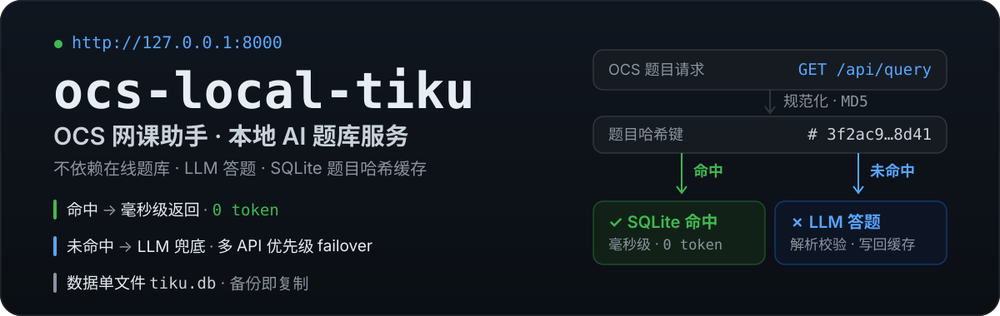
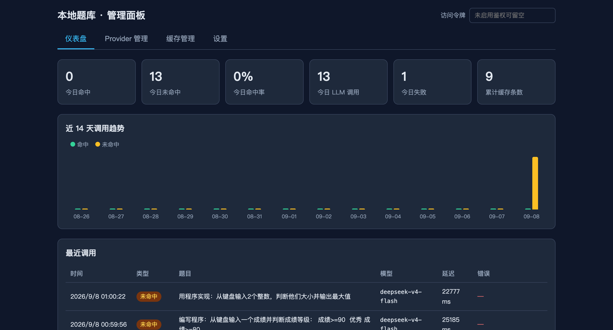
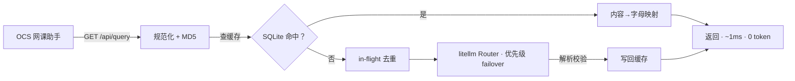

<h1> ocs-local-tiku</h1>

<p align="center">
  
</p>

不依赖任何在线题库——只要有任一 OpenAI 兼容 API（DeepSeek / 硅基流动 / Kimi / GLM / OpenAI …）即可自动答题，题库随使用自然沉淀。

> ⚠️ **使用边界**：本项目仅供个人学习与技术研究使用。使用者应遵守所在平台的规定与相关法律法规，并自行承担使用风险。

## 管理面板

内置零构建单页面板：仪表盘、Provider 管理、缓存管理（搜索 / 批删 / 导入 JSON·ZIP / 导出下载）与设置。



## 特性

- **OCS 原生对接**：兼容 [OCS](https://github.com/ocsjs/ocsjs) AnswererWrapper 题库协议，配置一段 JSON 即接入
- **哈希缓存**：题目规范化（全半角/空白/选项排序归一）→ MD5 主键 → 命中即回；同题选项乱序重放不 miss
- **答案防固化**：LLM 答案解析/选项匹配失败绝不入缓存；缓存存「答案内容」而非字母，选项乱序重放不答错
- **缓存自淘汰**：默认 60 天无命中自动删除，分批次清理不锁库
- **多 API 调度**：基于 [litellm](https://github.com/BerriAI/litellm) Router——优先级 failover、限流自动冷却、并发控制
- **Web 管理面板**：Provider 管理（测连/排序/启停）、缓存管理（导入导出）、命中率与 token 统计仪表盘
- **单文件数据**：缓存/配置/统计全在一个 `tiku.db`，备份 = 复制一个文件

## 快速开始

### 本地直跑

```bash
python3 -m venv .venv && source .venv/bin/activate   # macOS / Linux（Windows: .venv\Scripts\activate）
pip install -r requirements.txt
python run.py                                        # http://127.0.0.1:8000
```

> 也可用 [uv](https://docs.astral.sh/uv/)：`uv venv --python 3.13 && uv pip install -r requirements-dev.txt && uv run --no-project python run.py`

打开面板 → **Provider 管理**新增你的 API（base_url / api_key / model）→ 按 [OCS 端配置](#ocs-端配置)接入。

### OCS 端配置

OCS 全局设置 → 题库配置 → 新建，粘贴：

```json
[
  {
    "name": "本地AI题库",
    "url": "http://127.0.0.1:8000/api/query",
    "method": "get",
    "type": "GM_xmlhttpRequest",
    "contentType": "json",
    "data": { "title": "${title}", "type": "${type}", "options": "${options}" },
    "handler": "return (res) => res.code === 1 ? [res.question, res.answer] : undefined"
  }
]
```

### Docker（可选）

```bash
docker compose up -d --build
```

- 端口默认只绑宿主机回环 `127.0.0.1:8000`（局域网访问改 compose 里的 `ports`）
- 数据持久化于 named volume `tiku-data`（容器内 `/data/tiku.db`）
- 容器自带 healthcheck（`docker ps` 看 healthy）；时区 `Asia/Shanghai` 保证按天统计分桶正确

**备份**（宿主机当前目录得到 `tiku.db` 副本）：

```bash
docker run --rm -v tiku-data:/data -v "$PWD":/backup alpine cp /data/tiku.db /backup/
```

**空间回收**：大量删除/清理后 `tiku.db` 不会自动缩小（SQLite 特性），需要时做一次 VACUUM：

```bash
docker compose down
docker run --rm -v tiku-data:/data alpine sqlite3 /data/tiku.db "VACUUM;"
docker compose up -d
```

## 架构概览



详细设计（表结构 / API 清单 / 调度与清理策略 / 错误处理 / 测试策略）见 **[docs/design.md](docs/design.md)**。

## 路线图

- [x] **M1–M5 已交付**：缓存闭环 → litellm 调度与 Provider 管理 → Web 管理面板 → TTL 批次清理与批量导入 API → 面板导入/导出与 Docker 部署
- [ ] **二期**：tikuAdapter 题库格式互导 · FTS5 全文搜索 · 分流路由策略（usage-based / least-busy）

## 技术栈

Python 3.13 · FastAPI · aiosqlite · litellm · Alpine.js

## License

MIT
